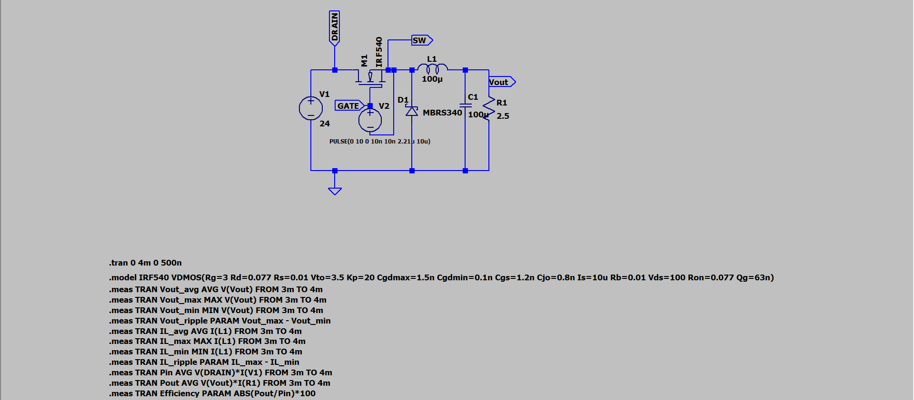
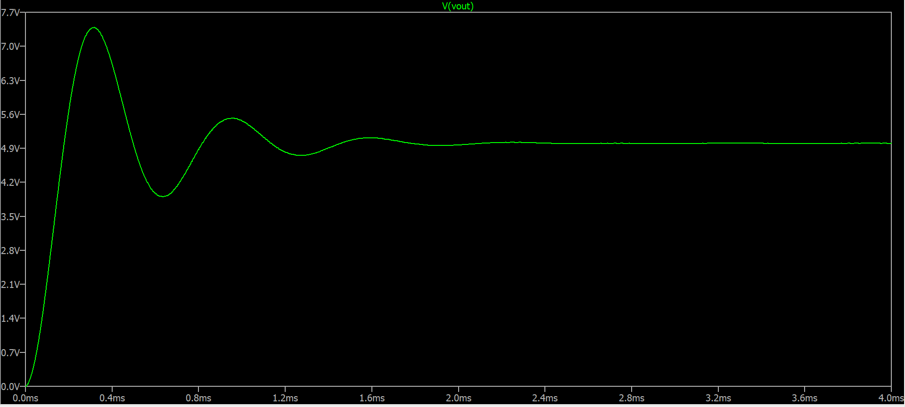
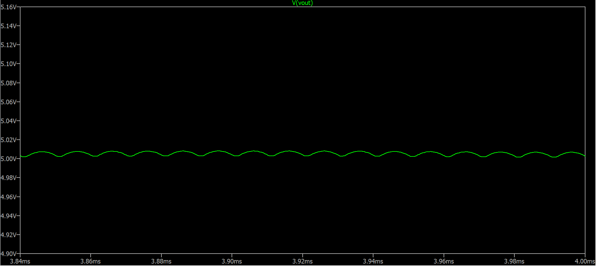
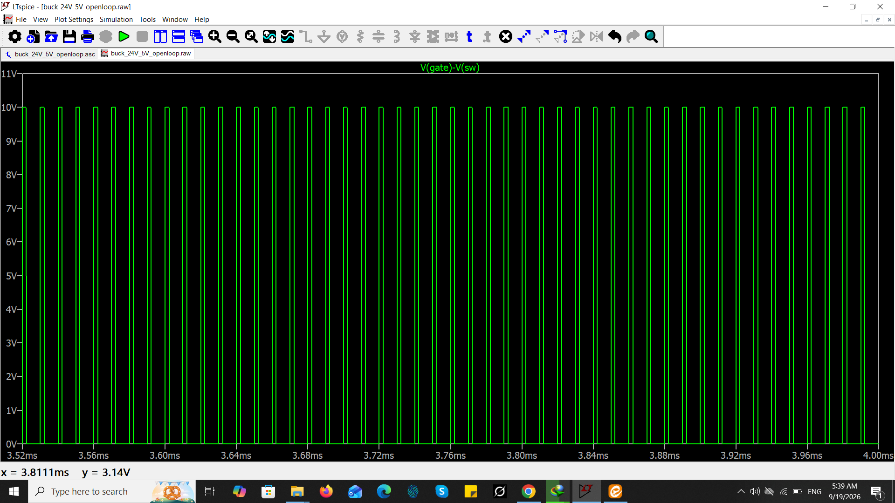
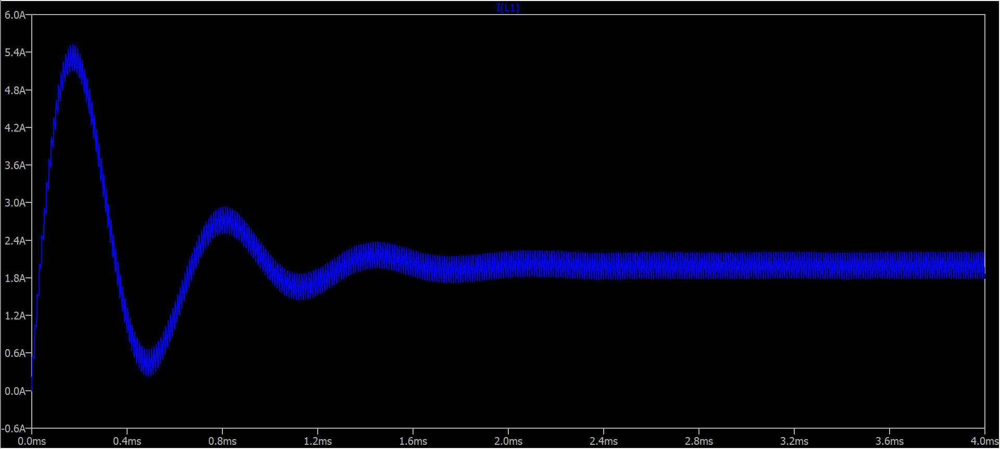
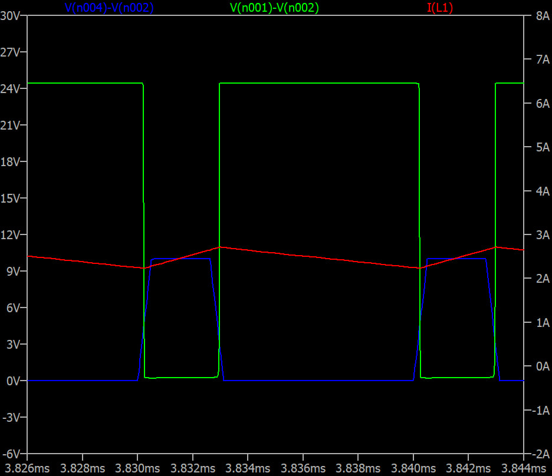

# Buck Converter 24V → 5V @ 2A

A complete design and simulation of a step-down (Buck) DC-DC converter 
in LTspice, converting 24V input to 5V output at 2A load current. 

## 📋 Specifications

| Parameter | Value |
|---|---|
| Input Voltage (Vin) | 24 V DC |
| Output Voltage (Vout) | 5.004 V |
| Output Current (Iout) | 2.002 A |
| Output Power | 10 W |
| Switching Frequency | 100 kHz |
| Duty Cycle | 22.1% |
| Topology | Buck (Step-down) |

## 🔧 Circuit Components

| Component | Value | Part Number |
|---|---|---|
| MOSFET | N-Channel | IRF540 |
| Diode | Schottky | MBRS340 |
| Inductor | 100 µH | - |
| Output Capacitor | 100 µF | - |
| Load Resistor | 2.5 Ω | - |
| Gate Driver | Pulse Source | 0-10V, 100kHz |

## 📐 Design Calculations

Full calculations are available in [docs/design_calculations.md](docs/design_calculations.md).

### Summary

Duty Cycle:
D = Vout / Vin = 5 / 24 ≈ 21%

Inductor Current Ripple:
ΔIL = (Vin - Vout) × D / (L × fsw) = 0.418 A (≈ 21% of Iout)

Output Voltage Ripple:
ΔVout = ΔIL / (8 × C × fsw) = 5.2 mV

## 📊 Simulation Results

| Parameter | Theory | Simulation | Error |
|---|---|---|---|
| Vout | 5.00 V | 5.004 V | 0.08% |
| Iout | 2.00 A | 2.002 A | 0.1% |
| Output Ripple | 5.2 mV | 15.0 mV | - |
| Inductor Ripple | 0.418 A | 0.433 A | 3.6% |
| Efficiency | - | 93.01% | - |

## 📈 Waveforms

### Complete Schematic

### Output Voltage (5V with 15mV ripple)

### Output Voltage Ripple (zoomed)

### Gate-Source Voltage (Vgs, 0-10V)

### Inductor Current (triangular, 1.8-2.2A)

## 🔍 Miller Plateau Analysis

The gate-source voltage waveform clearly shows the **Miller 
plateau** — a region where Vgs remains nearly constant while the 
drain-source voltage transitions rapidly.

### Why does this happen?

During turn-on:
1. The gate driver charges Cgs and Vgs rises to threshold (Vth)
2. The MOSFET starts conducting, causing Vds to drop rapidly
3. This rapid Vds transition injects current into the gate-drain 
   capacitance (Cgd) through the Miller effect
4. The gate driver current is diverted to charge Cgd instead of Cgs
5. Vgs remains flat (plateau) until Vds transition completes

### Why it matters:

| Issue | Impact |
|---|---|
| Switching losses | During plateau, high Vds AND high Id → high power loss |
| Gate driver design | Need sufficient drive current to quickly pass plateau |
| EMI | Fast Vds transitions cause electromagnetic interference |

### How to minimize Miller effect:

1. Stronger gate driver — higher current capability
2. Smaller gate resistor (Rg) — faster switching
3. MOSFET with lower Cgd (Crss) — choose appropriate device
4. Snubber circuits — reduce Vds dv/dt

## ⚡ Efficiency Breakdown

| Loss Component | Power |
|---|---|
| MOSFET conduction | ~65 mW |
| Diode conduction | ~630 mW |
| Switching losses | ~100 mW |
| Total losses | ~700 mW |
| Efficiency | 93.01% |

Note: The diode is the dominant loss source. Using **synchronous 
rectification** (replacing the diode with a MOSFET) could increase 
efficiency to 96%+.

## 🚀 How to Run

1. Download [LTspice](https://www.analog.com/en/design-center/design-tools-and-calculators/ltspice-simulator.html) (free)
2. Open simulation/buck_24V_5V_openloop.asc
3. Press F9 to run the simulation
4. Click on any node to view waveforms

## ⚠️ Limitations

This simulation uses ideal passive components:
- Inductor DCR not included
- Capacitor ESR not included
- MOSFET model is simplified

In real-world implementation, expect:
- Efficiency: 85-90% (due to parasitic losses)
- Higher output ripple (due to ESR)
- Thermal considerations for components

## 📚 References

- [LTspice Official](https://www.analog.com/en/design-center/design-tools-and-calculators/ltspice-simulator.html)
- Fundamentals of Power Electronics — Erickson & Maksimovic

## 👤 Author
Ashkan
- GitHub: [@ashkan-ee](https://github.com/ashkan-ee)

---

*This project was created as part of a power electronics portfolio.*
